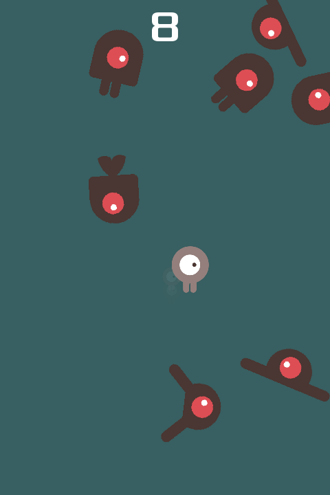
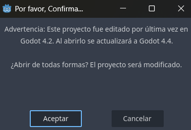
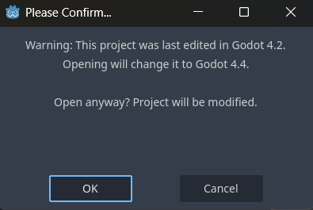
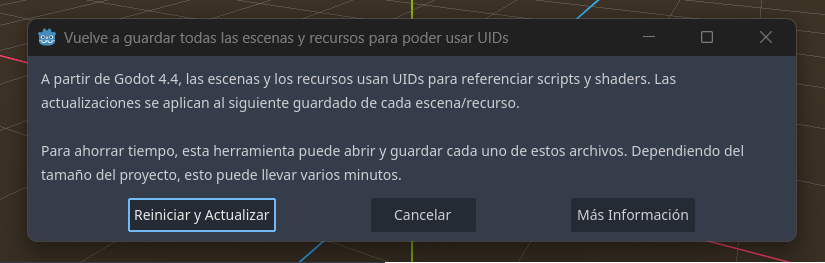
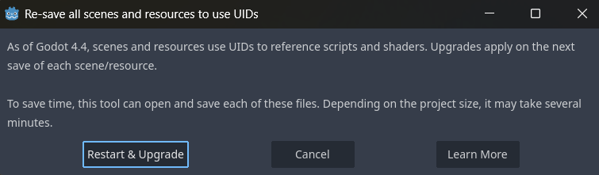

# Esquiva el enjambre

¡Prepárate para retorcerte mientras te abres paso por un mundo invadido por bichos!

## Sobre Esquiva El Enjambre

El juego trata sobre esquivar bichos que irán apareciendo de manera aleatoria en el mapa, mientras más tiempo estés vivo mejor.

## Origen

El juego nace del tutorial oficial de Godot para aprender a realizar el primer juego en 2D 
["Your first 2D game"](https://docs.godotengine.org/en/latest/getting_started/first_2d_game/index.html)

- Lenguaje de programación usado: GDScript
- Renderizado: Compatible
- El repo fue alterado para que fuera compatible con Godot 4.4.1
- El repo original está disponible en el siguiente enlace: https://godotengine.org/asset-library/asset/515
- Para mayor información se recomienda leer la documentación oficial.

## Capturas de pantalla

## Sobre la migración del código

El código fue migrado desde su origen en Godot 4.2 a Godot 4.4, a pesar que fueron cambios menores igual hubieron cambios que no pasaron desapercibidos.

### Primer mensaje

---

### Segundo mensaje

## Derechos de autor

`art/House In a Forest Loop.ogg` Copyright &copy; 2012 [HorrorPen](https://opengameart.org/users/horrorpen), [CC-BY 3.0: Attribution](http://creativecommons.org/licenses/by/3.0/). Source: https://opengameart.org/content/loop-house-in-a-forest

Images are from "Abstract Platformer". Created in 2016 by kenney.nl, [CC0 1.0 Universal](http://creativecommons.org/publicdomain/zero/1.0/). Source: https://www.kenney.nl/assets/abstract-platformer

Font is "Xolonium". Copyright &copy; 2011-2016 Severin Meyer <sev.ch@web.de>, with Reserved Font Name Xolonium, SIL open font license version 1.1. Details are in `fonts/LICENSE.txt`.
